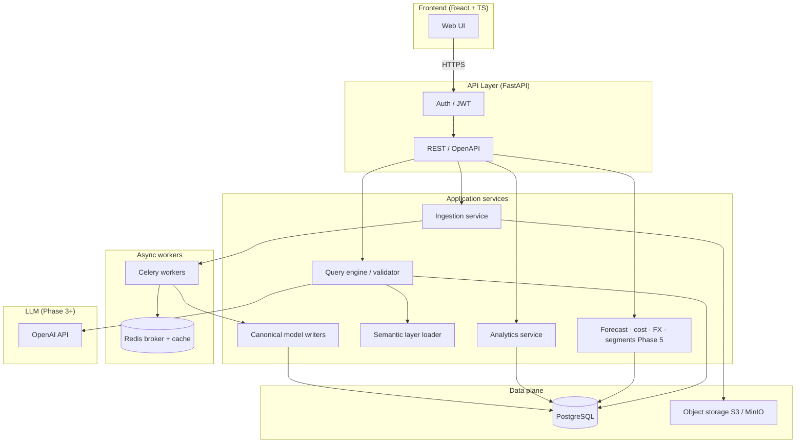

# Architecture Overview — Enterprise Revenue Intelligence Platform

**Status:** APPROVED  
**Approved:** 2026-04-03 (April 3, 2026)  
**Source of truth:** This document is authoritative for implementation. The Tech Lead must not deviate from it without `@technical-architect` review and explicit approval.

**Audience:** Technical Architect, Tech Lead, Security, DevOps  
**Source:** `docs/requirements/product-requirements.md`, `@technical-architect`  

---

## 1. System architecture (layers)

End-to-end flow from ingestion through natural-language query to the user:



**Text equivalent (layer stack):**

```
Excel / HubSpot (Phase 4) · forecast & cost imports (Phase 5)  →  [Ingestion: parse · validate · load / sync]  →  Canonical model (PostgreSQL)
                                                                         ↓
Semantic layer (YAML + governed mappings, Phase 3)  ←→  Query engine (structure · validate · execute)
                                                                         ↓
                                                              FastAPI (REST, auth, limits)
                                                                         ↓
                                                              React frontend (upload, tables, analytics, NL)
```

| Layer | Responsibility |
|--------|----------------|
| **Ingestion** | Accept uploads, store raw files, validate rows, resolve dimensions, write facts in transactions, record batches and errors. **Phase 5:** forecast and cost file paths reuse batch semantics where applicable. |
| **Canonical model** | Single schema for dimensions + `fact_revenue`; **Phase 5:** separate `fact_forecast`, `fact_cost`, FX rates, segment tables — numeric precision; import batch lineage. |
| **Semantic layer** | Business terms → allowed schema objects; versionable; no ad-hoc synonym drift without process. |
| **Query engine** | NL → structured plan (Phase 3); **never** execute raw LLM SQL; validate, parameterize, enforce read-only + limits. |
| **API** | Authentication, authorization checks, Pydantic contracts, timeouts, orchestration. |
| **Frontend** | Authenticated UX: upload, validation feedback, data views, later analytics and NL. |

---

## 2. Technology decisions and justification

| Choice | Role | Why (summary) |
|--------|------|----------------|
| **FastAPI** | HTTP API | Async-friendly I/O for uploads and DB; automatic OpenAPI; Pydantic v2 aligns with validation-heavy financial payloads; strong typing for maintainability. |
| **PostgreSQL 15+** | System of record | `NUMERIC`, constraints, JSONB for error logs, RLS for hierarchy-scoped access (Phase 2+), mature tooling, fits enterprise audit and reporting expectations. |
| **SQLAlchemy 2.0 (async)** | ORM | Typed models, migration alignment with Alembic, async sessions compatible with FastAPI. |
| **Alembic** | Migrations | Versioned, reviewable schema changes; required by product governance. |
| **Celery + Redis** | Background jobs | Excel over size/row threshold and long-running validation/load; retries and backoff per NFR; Redis as broker and optional cache. |
| **OpenAI API** | NL interpretation (Phase 3) | Product names configured provider; model name **only** from settings (`OPENAI_MODEL`), not literals. Swappable later if needed. |
| **React + TypeScript (Vite)** | UI | Typed client, component model, aligns with Tech Lead conventions (TanStack Query, Zustand, Tailwind). |
| **Object storage (S3 / MinIO)** | Raw files | Durable store for uploaded Excel before and during processing; API does not stream huge files only through app memory. |
| **Pydantic Settings** | Configuration | Single source for secrets and limits; no scattered `os.getenv`. |

---

## 3. What we are **not** using (and why)

Explicit non-goals help the Tech Lead avoid scope drift:

| Not in scope (now) | Reason |
|--------------------|--------|
| **Raw LLM-generated SQL executed on PostgreSQL** | Violates safety and audit requirements; must go through semantic mapping + structured builder + validator. |
| **FLOAT / double for money** | Product NFR: financial accuracy; use `NUMERIC(18,4)`. |
| **Hardcoded API keys or model names** | Security and configurability; use environment/settings only. |
| **MongoDB / document DB as primary financial store** | Need relational integrity, constraints, and SQL analytics path. |
| **Phase 1 customer-facing NL / MCP** | Per product phases; NL is Phase 3; optional dev spikes only with no shipped UX. |
| **HubSpot / CRM sync** | **Phase 1–3:** no production CRM connectors. **Phase 4** implements HubSpot ingestion only — see [`phase-4-changes.md`](phase-4-changes.md); other CRMs remain out of scope unless a change request. |
| **Enterprise SSO (SAML/OIDC)** | **Phase 6** — OIDC + SAML 2.0, JIT provisioning, federated identity; Phase 1–5 may use password/JWT; production enterprise pilots require SSO per [`phase-6-requirements.md`](../requirements/phase-6-requirements.md). |
| **Analytics at scale without precomputation** | Phase 1 is raw-fact listing only; Phase 2 adds materialized views or equivalent (see `database-schema.md` §7). |
| **Multi-tenant SaaS in first enterprise deployment** | Working assumption: dedicated deployment per customer; design may still carry `tenant_id` for future optionality. |

---

## 4. Security architecture

### 4.1 Where authentication happens

- **At the FastAPI boundary:** JWT validation in dependencies; **Phase 6** adds **OIDC** and **SAML 2.0** browser flows that **exchange** IdP assertions for the **same application JWT/session model** (see `phase-6-changes.md`) — every protected route requires an authenticated principal unless explicitly documented as dev-only or IdP callback.
- **Secrets:** Loaded via settings from environment (and optional vault / encrypted columns for rotating IdP secrets); never committed.

### 4.2 Where RBAC lives

- **Primary enforcement:** Application layer (FastAPI dependencies + service checks) using roles/scopes stored in PostgreSQL (e.g. user ↔ org/BU access tables). This implements “who may upload,” “who sees which org,” and later “BU Head vs CXO” rules.
- **Database roles:** Optional separate DB roles (e.g. `app_readonly` for NL/analytics execution path) with least privilege; **not** a substitute for app-level RBAC for multi-step workflows.

### 4.3 Where RLS lives

- **In PostgreSQL** on sensitive tables (e.g. `fact_revenue`), as defense in depth.
- **Phase 1:** May be permissive for pilot (single-tenant deployment, tenant-wide visibility) but **policies and `ENABLE ROW LEVEL SECURITY` should be designed** so Phase 2 hierarchy scoping is an extension, not a rewrite.
- **Phase 2:** RLS policies align with org/BU visibility; session variables (e.g. `app.user_id`, `app.tenant_id`) set by the API after auth for policy evaluation.
- **NL read path (Phase 3):** Prefer read-only DB role + RLS + row limits and timeouts together.

### 4.4 Audit

- **Imports:** `ingestion_batch` + optional append-only `audit_event` for high-level actions.
- **NL queries (Phase 3):** `query_audit_log` — who, natural language, resolved plan/safe SQL summary, timing, outcome.
- **Phase 6:** **SSO/security** events (login success/failure, export) append to **`audit_event`** (or dedicated security stream if volume warrants); **authorized** **`audit_export`** reads across event families within **operational retention** — see `api-contracts.md` §11.

---

## 5. Data flow: Excel upload → database → NL query → user

### 5.1 Excel upload (Phase 1)

1. User authenticates; frontend sends **multipart upload** to API with metadata (e.g. target org, optional replace intent).
2. API validates authz, stores raw file in **object storage**, creates **`ingestion_batch`** (`pending`), returns `batch_id` (sync small file may proceed inline; large file **202 + Celery** per product assumptions).
3. Worker loads spreadsheet, validates **all rows** (Phase 1: **fail entire file** on any validation error — no partial commit).
4. On success: resolve or validate dimension keys, insert **`fact_revenue`** rows with `batch_id`, `source_system='excel'`, stable **`external_id`** per row for idempotency; update batch `completed`.
5. On failure: batch `failed`, **`error_log` JSONB** with row/column messages; no incorrect facts persisted.

**Overlap / duplicate imports (working assumptions):**  
Before commit, check **tenant + agreed grain** (e.g. org + period). Default: **reject** if overlapping scope exists unless user requested **replace**; replace deletes prior facts for that scope in one transaction, then inserts (audited).

### 5.2 Viewing data (Phase 1)

- Frontend calls **GET** APIs for facts and batch status; amounts come straight from PostgreSQL **`NUMERIC`** columns; no float conversion in business logic.

### 5.3 NL query (Phase 3 — conceptual)

1. User submits natural language; API records intent and passes to **semantic layer** + **OpenAI** (model from `settings.OPENAI_MODEL`) to propose a **structured query plan**, not arbitrary SQL.
2. **Validator** checks allowlists, read-only, row caps, timeouts.
3. **Safe SQL generator** builds parameterized SQL; executor uses controlled session (RLS + readonly role where applicable).
4. Results formatted for UI; **`query_audit_log`** stores the audit trail.

---

## 6. Deployment model (working assumption)

- **First customer:** dedicated stack (app + DB + Redis + object storage) per customer to reduce cross-tenant risk and simplify compliance.
- Schema may still include **`tenant_id`** to keep a path to multi-tenant SaaS later without a breaking redesign.

---

## 7. Related documents

- `docs/architecture/database-schema.md` — tables, constraints, RLS, migrations  
- `docs/architecture/guidelines-for-tech-lead.md` — implementation rules  
- `docs/architecture/api-contracts.md` — HTTP contracts  
- `docs/architecture/phase-2-changes.md` — Phase 2 delta vs Phase 1 (approved Phase 2 requirements)  
- `docs/architecture/phase-3-changes.md` — Phase 3 delta vs Phase 2 (NL query, semantic layer, audit)  
- `docs/architecture/phase-4-changes.md` — Phase 4 delta vs Phase 3 (HubSpot OAuth, incremental sync, mapping, reconciliation)  
- `docs/architecture/phase-5-changes.md` — Phase 5 delta vs Phase 4 (forecast, profitability, segments, multi-currency)  
- `docs/architecture/phase-6-changes.md` — Phase 6 delta vs Phase 5 (enterprise SSO, audit export, admin operations)  

---

**Status:** APPROVED · **2026-04-03** — Source of truth. No implementation deviation without `@technical-architect` review. Schema changes require architect approval per product rules. Phase 3 execution details: `phase-3-changes.md` and `api-contracts.md` §8. Phase 4 (HubSpot): `phase-4-changes.md` and `api-contracts.md` §9. Phase 5: `phase-5-changes.md` and `api-contracts.md` §10. Phase 6: `phase-6-changes.md` and `api-contracts.md` §11.
