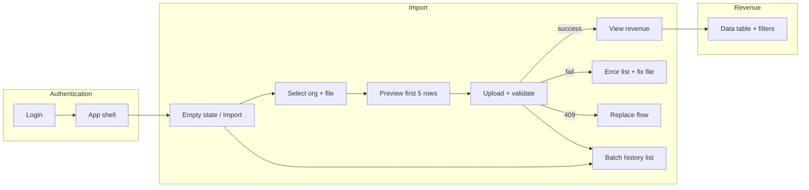

# User Flows — Phase 1 (Core Schema + Excel Import)

| Field | Value |
|--------|--------|
| **Status** | **Approved (PO)** — 2026-04-03 |
| **Aligned to** | `docs/requirements/product-requirements.md` (Phase 1 lock, **§5** approved decisions), `docs/architecture/api-contracts.md` |
| **Audience** | Product Owner, Tech Lead, QA |
| **Revision** | 2026-04-03 — PO review: import batch history, initiator field, reconciliation copy, registration scope, export note. |

This document maps every Phase 1 user journey as step-by-step flows with screen descriptions. It assumes **application authentication** (JWT) per approved product decisions; no anonymous access to financial data.

---

## Conventions used in flows

- **Screen** = a distinct view or modal the user occupies.
- **State** = visual mode of that screen (default, loading, error, success, empty).
- **API alignment** — Upload may return **200** (sync complete), **202** (async pending), **400/403/409/413/422** (client or conflict errors). Validation failure after processing uses **200** with `status: "failed"` and `error_log` per API contract.

---

## Flow 1: First-time user lands on the platform

### Goal

A new user understands what the product is for, authenticates safely, and knows **exactly one primary next action**: load revenue data via Excel (Phase 1 core loop).

### Preconditions

- User has credentials (registered tenant/user per deployment policy).
- Browser meets baseline support (modern evergreen).

### Registration and pilot access

**Phase 1 pilot default:** Users are **provisioned** (admin-created or invite-only). **Self-service registration** (`POST /auth/register`) is deployment-controlled; if disabled, the product provides **no** public sign-up screen—only **Login**. If registration is enabled for a pilot, a minimal **Register** screen may be added without changing the Import/Revenue flows below.

### Step-by-step (screen sequence)

| Step | Screen | What the user sees | What the user does |
|------|--------|--------------------|--------------------|
| 1 | **Login** | Centered card: product name (“Revenue Intelligence” or agreed branding), email field, password field, primary **Sign in** button, secondary link **Forgot password** (if implemented). No revenue data visible. | Enters email/password, submits or presses Enter. |
| 2 | **Login — loading** | Same layout; **Sign in** shows inline spinner; fields disabled. | Waits. |
| 3a | **Login — error** | Non-blocking alert above form: “Invalid email or password.” Fields re-enabled. | Corrects credentials and retries. |
| 3b | **App shell — first load** | After success: **Navigation sidebar** (left) + **main content**. User lands on **Import** (or **Home** that emphasizes import—see UX decisions). Main area shows **Import batch history** (empty) and **empty state** for uploads when no batches yet (see below). Header shows tenant name and user menu. | Reads empty state; primary CTA **Upload Excel** (or navigates via sidebar). |

### Empty state (first-time, no successful imports)

- **Headline:** e.g. “No revenue data loaded yet”
- **Body:** Short explanation: Excel-based ingestion loads facts into the governed schema; validation runs before any data is committed (aligned with fail-entire-file policy).
- **Primary CTA:** **Upload Excel** → starts Flow 2 at the upload surface.
- **Secondary:** Link **Download template** or **View column guide** (if Product provides a template URL or in-app sheet specs).
- **Trust cue:** One line on auditability, e.g. “Each successful load creates an import batch you can reference for reconciliation.”

### How they know what to do

1. **Single primary action** in empty state (upload), not competing CTAs.
2. **Sidebar** labels Phase 1 areas clearly: **Import** (upload + history), **Revenue** (view facts)—so mental model is load → review.
3. Optional **inline checklist** (3 bullets): Sign in → Upload file → Review imported rows—collapsed on repeat visits if desired (Phase 1 can ship static bullets).

### Edge cases

| Situation | Behavior |
|-----------|----------|
| Session expired while idle | Redirect to Login with optional message “Session expired.” |
| User has no upload role | Import upload disabled with tooltip / banner pointing to admin (PO policy). |

---

## Flow 2: Upload Excel file

### Goal

User selects target context (org, optional period scope), uploads `.xlsx`/`.xls`, sees **parsing → validation → outcome** (success summary or **full-file rejection** with row-level errors). Partial commits are **not** in scope for Phase 1.

### Entry points

- **Import** page: empty state CTA **Upload Excel**.
- **Import** page: **Replace** path when overlap exists (see step 7b).

### Step-by-step

| Step | Screen / region | What the user sees | What the user does |
|------|-----------------|--------------------|--------------------|
| 1 | **Import — default** | Page title “Import revenue”. **Upload drop zone** (see component specs). Above or beside: **Organization** selector (required), optional **Period start / Period end** (date pickers), optional helper text on overlap grain. **Replace existing data for this scope** checkbox (off by default) with warning copy. **Below** the upload/result area: **Import batch history** table (`GET /ingest/batches`)—lists recent batches with status; empty state until first import. | Selects org, sets period if needed, decides on Replace, clicks drop zone or **Browse**; may open a batch from history for detail. |
| 2 | **File selected — preview** | **File preview table** shows **first 5 rows** (header + data) read client-side or from a lightweight parse endpoint—implementation detail; UX shows filename, file size, row estimate if available. **Primary:** **Start import** (or **Upload and validate**). **Secondary:** **Choose different file**. | Confirms the file looks right; proceeds or changes file. |
| 3 | **Upload — in progress (sync path)** | **Ingestion progress tracker** on same page: staged steps e.g. Upload → Validate → Commit (wording TBD). Progress indeterminate or % if API exposes it. Drop zone disabled. | Waits; can **Cancel** only if API supports cancel (optional Phase 1; else hide). |
| 4 | **Upload — in progress (async path)** | API returns **202** `pending`: same tracker shows **Processing in background** with **batch id** (copy-friendly). Polling or websocket updates until terminal state. | Waits; may navigate away if product allows with toast “Import continues in background” (PO decision). |
| 5a | **Success** | **Success summary card**: batch id, filename, total rows, loaded rows, period covered, completed timestamp, **Uploaded by** (email or name resolved from `initiated_by` when API exposes it—see `ux-decisions.md` if deferred). Link **View revenue data** (filters preset to batch or date range). **Import batch history** updates (new row at top or refreshed). | Clicks through to revenue table or starts another upload. |
| 5b | **Validation failure (entire file rejected)** | Page retains context (org, period). **Error list** shows row-level issues from `error_log.errors` (row, column, message). **Success summary** not shown as success—use error region styling. Primary: **Fix file and re-upload**. Secondary: **Download error report** (CSV of errors—nice-to-have; PO approval). | Fixes spreadsheet offline; re-runs Flow 2 from step 1. |
| 6 | **HTTP / business errors** | | |
| 6a | **400** — bad file type | Inline alert on drop zone: “Only .xlsx and .xls are supported.” | Picks valid file. |
| 6b | **413** — file too large | Alert: “File exceeds maximum size.” Link to limits doc. | Splits file or contacts admin. |
| 6c | **409** — overlapping scope without Replace | Modal or inline **Conflict** panel: explains existing batch covers same tenant/org/period scope. Actions: **Cancel**, or enable **Replace** and require explicit confirmation (“This will delete prior facts for this scope in one transaction”) then re-upload. | Chooses replace flow or cancels. |
| 6d | **403** — not allowed | Banner: insufficient permission; no upload. | Stops; contacts admin. |

### States checklist (Flow 2)

| State | User-visible signals |
|-------|---------------------|
| Default | Empty or idle drop zone; form ready. |
| Hover | Drop zone highlight; buttons hover styles per design system. |
| File staged | Preview table + confirm actions. |
| Loading / processing | Progress tracker active; primary actions disabled where appropriate. |
| Success | Success summary card + optional navigation to revenue. |
| Error (validation) | Error list; file not committed; actionable copy. |
| Error (HTTP) | Typed messages per table above. |
| Disabled | No permission or missing org selection—**Upload** disabled with reason. |

### What happens if the file has errors?

Per locked requirements: **fail entire file** — **zero rows** committed when validation fails. The UI must:

1. State clearly: **“No data was loaded”** or **“Import failed; your database was not updated.”**
2. List **row/column/message** for each reported error (scrollable **Error list**).
3. Avoid stack traces; use Finance-friendly language (aligned with Story 1.2).

---

## Flow 3: View imported data

### Goal

After a successful import, the user can **inspect revenue facts** in a structured table, trust that displayed amounts match the backend, and perform a minimal **spot-check** for reconciliation.

### Preconditions

- At least one successful batch exists **or** user navigates to **Revenue** with filters that return rows.

### Step-by-step

| Step | Screen | What the user sees | What the user does |
|------|--------|--------------------|--------------------|
| 1 | **Revenue — default** | **Data table** of revenue facts: columns aligned to API (`amount` as decimal string display, `currency_code`, `revenue_date`, hierarchy IDs or resolved names if Phase 1 joins labels, `source_system`, `batch_id`). **Filters:** org, optional BU/division, date range; optional **batch_id** filter preset when arriving from success card. Pagination controls (`limit`/`cursor`). | Scrolls, sorts if supported (PO: client vs server sort), changes filters. |
| 2 | **Revenue — loading** | Table skeleton or row placeholders; filters disabled or show loading. | Waits. |
| 3 | **Revenue — empty** | Empty state: “No revenue rows for these filters.” Suggestion to widen dates or **Import** link. | Adjusts filters or goes to Import. |
| 4 | **Revenue — error** | Inline alert: failed to load; **Retry**. | Retries. |
| 5 | **Spot-check / correctness** | **Reconciliation strip** (user-facing): short helper text that amounts are shown **as stored** for the current filters; show **row count** on this page and **subtotal of amounts for this page only** (unless API adds a full-result aggregate—see `ux-decisions.md`). Footnote when only page subtotal is available: e.g. “Subtotal is for this page only—narrow filters or use export for full extract.” **Copy batch id** (from table or filter context) for Finance audit. Optional **Export CSV** of the current result set when approved for Phase 1 (`ux-decisions.md`). | Compares to source file or external systems offline. |

### How they know the data is correct

1. **Consistency:** Same **batch_id** and **revenue_date** visible as in import success summary.
2. **Precision:** Amounts rendered as formatted decimals (no float artifacts); design system specifies monospace or tabular nums for currency column.
3. **Transparency:** **Import** screen lists batch history with status—user can tie a table filter to a batch.
4. **No silent failure:** If import failed, **Revenue** does not show new rows from that attempt (NFR: user-visible state matches DB).

### Edge cases

| Situation | Behavior |
|-----------|----------|
| Large datasets | Pagination mandatory; show “Showing 50 of many—use filters.” |
| Async import still running | Revenue may not include new rows until completed; show banner “Import in progress” if user deep-links (ties to batch status poll). |

---

## Flow diagram (high level)

---

## Traceability

| PRD story | Flows |
|-----------|--------|
| 1.1 Upload and ingest | Flow 2 |
| 1.2 Validation and error reporting | Flow 2 (failure branches) |
| 1.3 View imported revenue | Flow 3 |
| Auth / no anonymous access | Flow 1, 3 |
| Finance traceability (batches, who loaded) | Flow 2 (success + **Import batch history**), Flow 3 |

**Note:** Story 1.1 acceptance text that mentions “partial success” is **superseded** by approved product decision **§5 #2** (fail entire file). UX aligns with **§5**, not legacy open-question wording.

*End of document.*
